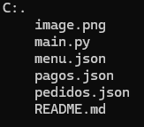

# MoliPollito

Realización del trabajo asignado en clase.

## Descripción

Se crearon dos menús diferentes para mayor entendimiento por parte del cliente.

## Tecnologías utilizadas

### Python

## Estructura

## Características

Se crearon archivos json, un archivo Readme y un archivo .py para la creación del código.

## Instrucciones

1. Copiar el enlace del repositorio.
2. Clonar el repositorio.
3. Abrir el archivo en consola ingresando "python (nombre del archivo)".

## Desarrollado por

El trabajo fue desarrollado por Alejandra Machuca, estudiante de CampusLands Grupo T2.
